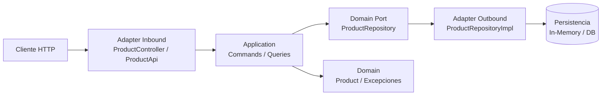

# Java Spring Course

## Informacion General

| Campo | Valor |
| --- | --- |
| Nombre del proyecto | `java-spring-course` |
| Group ID | `com.evhorus` |
| Artifact ID | `java-spring-course` |
| Version | `0.0.1-SNAPSHOT` |
| Descripcion | `Spring Course` |
| Java | `17` |
| Spring Boot | `3.5.10` |

## Estructura del Proyecto (Hexagonal)

La estructura en `src` sigue arquitectura hexagonal por modulo (`product`):

- `domain`: reglas de negocio y puertos.
- `application`: casos de uso (commands/queries/scheduling).
- `infrastructure`: adaptadores de entrada/salida (API, DB, mappers).

```text
src/
├── main/
│   ├── java/com/evhorus/java_spring_course/
│   │   ├── common/
│   │   │   ├── config/
│   │   │   ├── exceptions/
│   │   │   ├── mediator/
│   │   │   └── util/
│   │   ├── product/
│   │   │   ├── application/
│   │   │   │   ├── command/{create,delete,update}/
│   │   │   │   ├── query/{getAll,getById}/
│   │   │   │   └── scheduling/
│   │   │   ├── domain/
│   │   │   │   ├── entity/
│   │   │   │   ├── exception/
│   │   │   │   └── port/
│   │   │   └── infrastructure/
│   │   │       ├── api/{dto,mapper}/
│   │   │       └── database/{entity,mapper}/
│   │   └── JavaSpringCourseApplication.java
│   └── resources/
│       ├── application.yml
│       ├── application-dev.yml
│       ├── application-test.yml
│       └── application-prod.yml
└── test/
    ├── java/com/evhorus/java_spring_course/
    │   ├── IT/
    │   └── product/
    └── resources/
```

## Grafico de Arquitectura



## Tecnologias y Dependencias

| Dependencia | Proposito |
| --- | --- |
| `spring-boot-starter-web` | API REST con Spring MVC |
| `spring-boot-starter-validation` | Validacion de DTOs |
| `spring-boot-starter-actuator` | Observabilidad y health checks |
| `springdoc-openapi-starter-webmvc-ui` | Swagger/OpenAPI |
| `lombok` | Reduccion de boilerplate |
| `mapstruct` | Mapeo entre modelos |
| `spring-boot-starter-test` | Testing (JUnit, MockMvc, Mockito) |

## Ejecucion

```bash
./mvnw spring-boot:run
```

## Pruebas

```bash
./mvnw test
```

Nota: en este entorno puede fallar Mockito por restricciones del agente ByteBuddy al adjuntarse a la JVM.

## Endpoints utiles

- Swagger UI: `http://localhost:8080/swagger-ui.html`
- OpenAPI JSON: `http://localhost:8080/v3/api-docs`
- Actuator Health: `http://localhost:8080/actuator/health`

